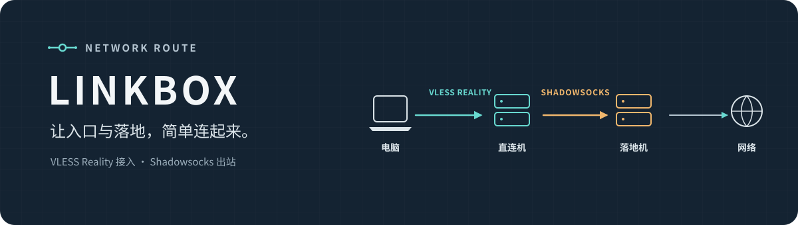

<p align="center">
  
</p>

<p align="center">
  <a href="https://github.com/aoomee/linkbox/actions/workflows/check.yml"></a>
  
  <a href="LICENSE"></a>
</p>

LINKBOX 用来管理一条简单的中转链路：**直连机运行 VLESS Reality，落地机运行 Shadowsocks（SS）**。两台服务器可以在不同地区、使用不同商家和 Linux 系统。主菜单只保留“节点管理”和“进阶功能”。

## 快速开始

在直连机和落地机上分别以 `root` 登录，复制这一行运行：

```sh
wget -qO- 'https://raw.githubusercontent.com/aoomee/linkbox/main/install.sh?v=1.0.3' | sh
```

Debian / Ubuntu 如果没有 `wget`，先运行 `apt-get update && apt-get install -y wget ca-certificates`。

安装后输入 `lb` 打开菜单。

| 服务器 | 菜单操作 | 结果 |
| --- | --- | --- |
| **落地机** | `节点管理 → 创建 SS 落地` | 创建 SS，复制生成的 Token |
| **直连机** | `进阶功能 → 导入落地 → 创建 VLESS` | 粘贴 Token，生成客户端链接 |

把生成的 VLESS Reality 链接导入兼容的电脑或手机客户端即可。

## 能做什么

| 节点管理 | 进阶功能 |
| --- | --- |
| 创建 SS 落地或 VLESS Reality 节点 | 导入 SS Token，一步创建 VLESS |
| 查看分享链接、导出 Token | 切换已有 VLESS 使用的落地 |
| 修改、删除节点 | 添加 TCP / UDP 端口转发 |
| 管理多个入口和落地 | 查看服务状态、诊断或卸载 |

VLESS 使用 Reality + Vision；SS 默认使用 AES-256-GCM 并随机生成密码。创建 VLESS 时会生成 UUID、Reality 密钥和 Short ID，并检查握手域名的 TLS 1.3 可达性，无需申请证书。每个 VLESS 入口可独立选择 SS 出站；单独创建的 VLESS 默认使用本机出口。切换落地只调整直连机的出站，已有 VLESS 链接保持不变。落地不可用时连接会失败，不会自动回退到直连机出口。

## 公网映射怎么填

如果商家提供 `A IP:50001 → 落地机内部:8388`，创建 SS 时填写：

| 字段 | 填写值 |
| --- | --- |
| 公网地址、连接端口 | `A IP`、`50001` |
| 本机监听端口 | `8388` |

Token 会带上公网地址和公网端口；直连机通过这个入口连接落地机。直连机本身也有 NAT 映射时，同样填写实际的公网入口。脚本不会修改防火墙、安全组或商家端口映射。

域名或 IPv4 默认监听 `0.0.0.0`，IPv6 地址默认监听 `::`；可以在节点设置中更改监听地址。端口转发固定转发到指定目标端口，不做协议转换。

<details>
<summary>系统要求与安装细节</summary>

支持 Debian 11+、Ubuntu 20.04+（需要 systemd）和完整 Alpine Linux（需要 OpenRC）；安装器自动安装 Python 3.8+。支持 x86_64、aarch64 和 armv7l。普通容器环境不在支持范围内。

安装器下载官方 sing-box 1.14.2 核心，并按系统 libc 类型和 CPU 架构校验固定 SHA-256。LINKBOX 使用独立的程序路径与服务名，不接管系统上已有的 sing-box、GOST 或其他服务。

下载遇到中断时会重试，并尝试 HTTP/1.1、IPv4 和 IPv6；安装前校验固定 SHA-256，不会跳过 HTTPS 证书或文件校验。

</details>

<details>
<summary>Token、安全与网络说明</summary>

- Token 是编码后的 SS 连接信息，**不是加密文件**；拿到 Token 的人可以取得 SS 密码并使用节点，请只在自己的服务器之间传递。
- Token 不包含 SSH 密码或 Reality 私钥。配置保存在服务器本地，不会上传到 GitHub 或第三方服务。
- 导入时会校验字段、协议、地址、端口和长度，不会执行 Token 中的命令。支持 LINKBOX Token 和无插件的标准 `ss://` 链接；支持 AES-128-GCM、AES-256-GCM、ChaCha20-IETF-Poly1305。不支持其他脚本的 ENC / ENC2 Token。
- 更换落地机 SS 密码后，旧 Token 会失效；在直连机用“切换落地”导入新 Token。
- SS 监听需要 TCP / UDP；VLESS Reality 入口使用 TCP。跨 VLESS 的 UDP 流量由入口 TCP 承载。
- 创建成功表示本地配置、服务和监听检查通过；NAT、防火墙和端到端连接仍需按实际网络验证。

</details>

<details>
<summary>配置恢复、日志与卸载</summary>

应用前会用 `sing-box check` 检查配置；应用失败时会尝试恢复上一个配置与服务状态。配置按版本保存，文件默认仅 root 可读；如果操作被中断，再次运行 `lb` 会检查并恢复事务。

修改、删除或切换节点会短暂重启 LINKBOX 服务，可能中断由本工具管理的其他连接。

菜单中的“停止”也会关闭开机自启；之后添加或修改节点会重新启用服务。请使用菜单修改节点，避免直接编辑自动生成的配置。

| 内容 | 路径 |
| --- | --- |
| 快捷命令 | `/usr/local/bin/lb` |
| 管理器与核心 | `/usr/local/lib/linkbox/` |
| 当前配置与节点状态 | `/etc/linkbox/current/` |

查看服务和日志：

- Debian / Ubuntu：`systemctl status linkbox`、`journalctl -u linkbox -n 50 --no-pager`
- Alpine：`rc-service linkbox status`、`tail -n 50 /var/log/linkbox.log`

菜单中的卸载操作需要输入 `DELETE` 确认，会移除 LINKBOX 自己的节点、密钥、服务与程序，保留系统依赖和历史服务日志。

</details>

<details>
<summary>测试与参考</summary>

仓库包含 Token / 路由校验、事务恢复和 VLESS Reality → SS 集成测试。CI 覆盖 Debian、Ubuntu、Alpine 的 x86_64 运行，以及 Ubuntu 的 systemd 服务生命周期；其他 CPU 架构和真实 NAT 网络需要在目标机器验证。

本地运行测试：

```sh
python3 -m unittest discover -s tests -v
python3 tests/integration.py /path/to/sing-box
```

交互流程参考 [singbox-lite](https://github.com/0xdabiaoge/singbox-lite)。配置依据 [sing-box 官方文档](https://sing-box.sagernet.org/configuration/)。管理器代码采用 MIT 许可；sing-box 核心遵循其自身许可。

</details>
